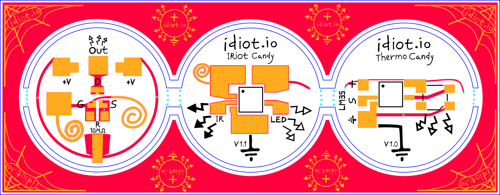

# candy
Electrodible lolliPCBpops



34c3 video cooking show and talk  


more at [idiot.io](idiot.io)


## tools
the design was made in [inkscape](https://inkscape.org) by zohar

[svg2shenzen](https://github.com/badgeek/svg2shenzhen) is an extension to inkscape that allows you to design a board in inkscape and export it to a [kicad](https://kicad.github.io) (an EDA for printed circuit board making), from kicad you can export gerber files. i used that route for the silkscreen only. its much nicer the eagle "import BMP" script. 

we dont even need to open kicad as we use a script to automate the gerber file generation.  
after you run `extensins>svg2shenzhen>export`  
run  
```python2 ../kicad_gerber_gen.py IRiotCandy-svg2shnzn.kicad_pcb```

[gerbv](http://gerbv.geda-project.org) was then used to preview the gerber output and move the silkscreen to its right position. if you have it in your path, the previous python script should auto open the generate dgerber files fo you. 

yair
